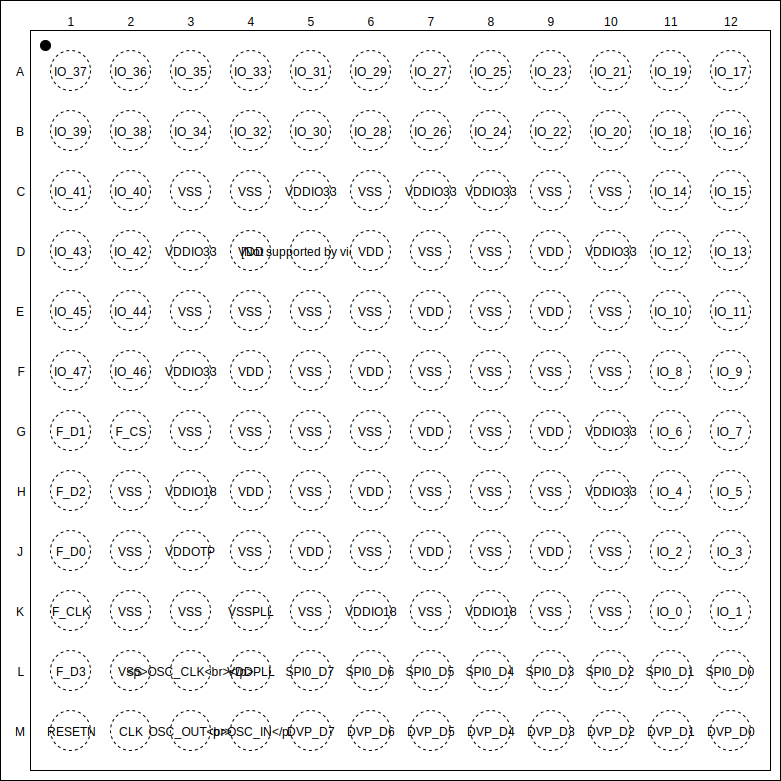

# 引脚定义

## 引脚布局

## 引脚描述

| Pins | Pin name | Type | Main function (after reset) |
|:----:|:--------:|:----:|:---------------------------:|
| A1   | IO\_37    | I/O  | GPIOHS21                    |
| A2   | IO\_36    | I/O  | GPIOHS20                    |
| A3   | IO\_35    | I/O  | GPIOHS19                    |
| A4   | IO\_33    | I/O  | GPIOHS17                    |
| A5   | IO\_31    | I/O  | GPIOHS15                    |
| A6   | IO\_29    | I/O  | GPIOHS13                    |
| A7   | IO\_27    | I/O  | GPIOHS11                    |
| A8   | IO\_25    | I/O  | GPIOHS9                     |
| A9   | IO\_23    | I/O  | GPIOHS7                     |
| A10  | IO\_21    | I/O  | GPIOHS5                     |
| A11  | IO\_19    | I/O  | GPIOHS3                     |
| A12  | IO\_17    | I/O  | GPIOHS1                     |
| B1   | IO\_39    | I/O  | GPIOHS23                    |
| B2   | IO\_38    | I/O  | GPIOHS22                    |
| B3   | IO\_34    | I/O  | GPIOHS18                    |
| B4   | IO\_32    | I/O  | GPIOHS16                    |
| B5   | IO\_30    | I/O  | GPIOHS14                    |
| B6   | IO\_28    | I/O  | GPIOHS12                    |
| B7   | IO\_26    | I/O  | GPIOHS10                    |
| B8   | IO\_24    | I/O  | GPIOHS8                     |
| B9   | IO\_22    | I/O  | GPIOHS6                     |
| B10  | IO\_20    | I/O  | GPIOHS4                     |
| B11  | IO\_18    | I/O  | GPIOHS2                     |
| B12  | IO\_16    | I/O  | GPIOHS0                     |
| C1   | IO\_41    | I/O  | GPIOHS25                    |
| C2   | IO\_40    | I/O  | GPIOHS24                    |
| C3   | VSS      | S    | VSS                         |
| C4   | VSS      | S    | VSS                         |
| C5   | VDDIO33  | S    | VDDIO33                     |
| C6   | VSS      | S    | VSS                         |
| C7   | VDDIO33  | S    | VDDIO33                     |
| C8   | VDDIO33  | S    | VDDIO33                     |
| C9   | VSS      | S    | VSS                         |
| C10  | VSS      | S    | VSS                         |
| C11  | IO\_14    | I/O  | GPIO6                       |
| C12  | IO\_15    | I/O  | GPIO7                       |
| D1   | IO\_43    | I/O  | GPIOHS27                    |
| D2   | IO\_42    | I/O  | GPIOHS26                    |
| D3   | VDDIO33  | S    | VDDIO33                     |
| D4   | VDD      | S    | VDD                         |
| D5   | VSS      | S    | VSS                         |
| D6   | VDD      | S    | VDD                         |
| D7   | VSS      | S    | VSS                         |
| D8   | VSS      | S    | VSS                         |
| D9   | VDD      | S    | VDD                         |
| D10  | VDDIO33  | S    | VDDIO33                     |
| D11  | IO\_12    | I/O  | GPIO4                       |
| D12  | IO\_13    | I/O  | GPIO5                       |
| E1   | IO\_45    | I/O  | GPIOHS29                    |
| E2   | IO\_44    | I/O  | GPIOHS28                    |
| E3   | VSS      | S    | VSS                         |
| E4   | VSS      | S    | VSS                         |
| E5   | VSS      | S    | VSS                         |
| E6   | VSS      | S    | VSS                         |
| E7   | VDD      | S    | VDD                         |
| E8   | VSS      | S    | VSS                         |
| E9   | VDD      | S    | VDD                         |
| E10  | VSS      | S    | VSS                         |
| E11  | IO\_10    | I/O  | GPIO2                       |
| E12  | IO\_11    | I/O  | GPIO3                       |
| F1   | IO\_47    | I/O  | GPIOHS31                    |
| F2   | IO\_46    | I/O  | GPIOHS30                    |
| F3   | VDDIO33  | S    | VDDIO33                     |
| F4   | VDD      | S    | VDD                         |
| F5   | VSS      | S    | VSS                         |
| F6   | VDD      | S    | VDD                         |
| F7   | VSS      | S    | VSS                         |
| F8   | VSS      | S    | VSS                         |
| F9   | VSS      | S    | VSS                         |
| F10  | VSS      | S    | VSS                         |
| F11  | IO\_8     | I/O  | GPIO0                       |
| F12  | IO\_9     | I/O  | GPIO1                       |
| G1   | F\_D1     | I/O  | F\_D1                        |
| G2   | F\_CS     | O    | F\_CS                        |
| G3   | VSS      | S    | VSS                         |
| G4   | VSS      | S    | VSS                         |
| G5   | VSS      | S    | VSS                         |
| G6   | VSS      | S    | VSS                         |
| G7   | VDD      | S    | VDD                         |
| G8   | VSS      | S    | VSS                         |
| G9   | VDD      | S    | VDD                         |
| G10  | VDDIO33  | S    | VDDIO33                     |
| G11  | IO\_6     | I/O  | (FLOAT*)                    |
| G12  | IO\_7     | I/O  | (FLOAT*)                    |
| H1   | F\_D2     | I/O  | F\_D2                        |
| H2   | VSS      | S    | VSS                         |
| H3   | VDDIO18  | S    | VDDIO18                     |
| H4   | VDD      | S    | VDD                         |
| H5   | VSS      | S    | VSS                         |
| H6   | VDD      | S    | VDD                         |
| H7   | VSS      | S    | VSS                         |
| H8   | VSS      | S    | VSS                         |
| H9   | VSS      | S    | VSS                         |
| H10  | VDDIO33  | S    | VDDIO33                     |
| H11  | IO\_4     | I/O  | UARTHS\_RX                   |
| H12  | IO\_5     | I/O  | UARTHS\_TX                   |
| J1   | F\_D0     | I/O  | F\_D0                        |
| J2   | VSS      | S    | VSS                         |
| J3   | VDDOTP   | S    | VDDOTP                      |
| J4   | VSS      | S    | VSS                         |
| J5   | VDD      | S    | VDD                         |
| J6   | VSS      | S    | VSS                         |
| J7   | VDD      | S    | VDD                         |
| J8   | VSS      | S    | VSS                         |
| J9   | VDD      | S    | VDD                         |
| J10  | VSS      | S    | VSS                         |
| J11  | IO\_2     | I/O  | JTAG\_TMS                    |
| J12  | IO\_3     | I/O  | JTAG\_TDO                    |
| K1   | F\_CLK    | O    | F\_CLK                       |
| K2   | VSS      | S    | VSS                         |
| K3   | VSS      | S    | VSS                         |
| K4   | VSSPLL   | S    | VSSPLL                      |
| K5   | VSS      | S    | VSS                         |
| K6   | VDDIO18  | S    | VDDIO18                     |
| K7   | VSS      | S    | VSS                         |
| K8   | VDDIO18  | S    | VDDIO18                     |
| K9   | VSS      | S    | VSS                         |
| K10  | VSS      | S    | VSS                         |
| K11  | IO\_0     | I/O  | JTAG\_TCLK                   |
| K12  | IO\_1     | I/O  | JTAG\_TDI                    |
| L1   | F\_D3     | S    | F\_D3                        |
| L2   | TESTEN   | I    | TESTEN                      |
| L3   | OSC\_CLK  | O    | OSC\_CLK                     |
| L4   | VDDPLL   | S    | VDDPLL                      |
| L5   | SPI0\_D7  | O    | (FLOAT*)                    |
| L6   | SPI0\_D6  | O    | (FLOAT*)                    |
| L7   | SPI0\_D5  | O    | (FLOAT*)                    |
| L8   | SPI0\_D4  | O    | (FLOAT*)                    |
| L9   | SPI0\_D3  | O    | (FLOAT*)                    |
| L10  | SPI0\_D2  | O    | (FLOAT*)                    |
| L11  | SPI0\_D1  | O    | (FLOAT*)                    |
| L12  | SPI0\_D0  | O    | (FLOAT*)                    |
| M1   | RESET    | I    | RESET                       |
| M2   | CLK      | I    | CLK                         |
| M3   | OSC\_OUT  | O    | OSC\_OUT                     |
| M4   | OSC\_IN   | I    | OSC\_IN                      |
| M5   | DVP\_D7   | I    | (FLOAT*)                    |
| M6   | DVP\_D6   | I    | (FLOAT*)                    |
| M7   | DVP\_D5   | I    | (FLOAT*)                    |
| M8   | DVP\_D4   | I    | (FLOAT*)                    |
| M9   | DVP\_D3   | I    | (FLOAT*)                    |
| M10  | DVP\_D2   | I    | (FLOAT*)                    |
| M11  | DVP\_D1   | I    | (FLOAT*)                    |
| M12  | DVP\_D0   | I    | (FLOAT*)                    |

(FLOAT*): 无默认功能

## 电源电路

Power domain | Pin name | Voltage(V) | Maxim Current(mA)
-------------|----------|------------|-------------------
Core         | VDD      | 0.9        | 1000
Core         | VSS      |            |
IO           | VDDIO33  | 3.3        | 200
IO           | VSS      |            |
IO           | VDDIO18  | 1.8        | 200
IO           | VSS      |            |
IO           | VDDOTP   | 1.8        | 50
IO           | VSS      |            |
Analog       | VDDPLL   | 0.9        | 15
Analog       | VSSPLL   |            |

## 复位电路

## 特殊引脚
